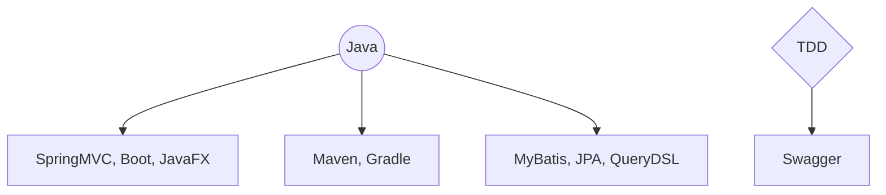

`Vue 3` is the latest version of the Vue.js framework and comes with several new features and improvements over ***Vue 2***. Some of the major differences between ***Vue 2*** and `Vue 3` are:

```mermaid
flowchart TD
    A((Java))
    A-->A-1[SpringMVC, Boot, JavaFX]
    A-->A-2[Maven, Gradle]
    A-->A-3[MyBatis, JPA, QueryDSL]
    G{TDD}-->K[Swagger]
``` 